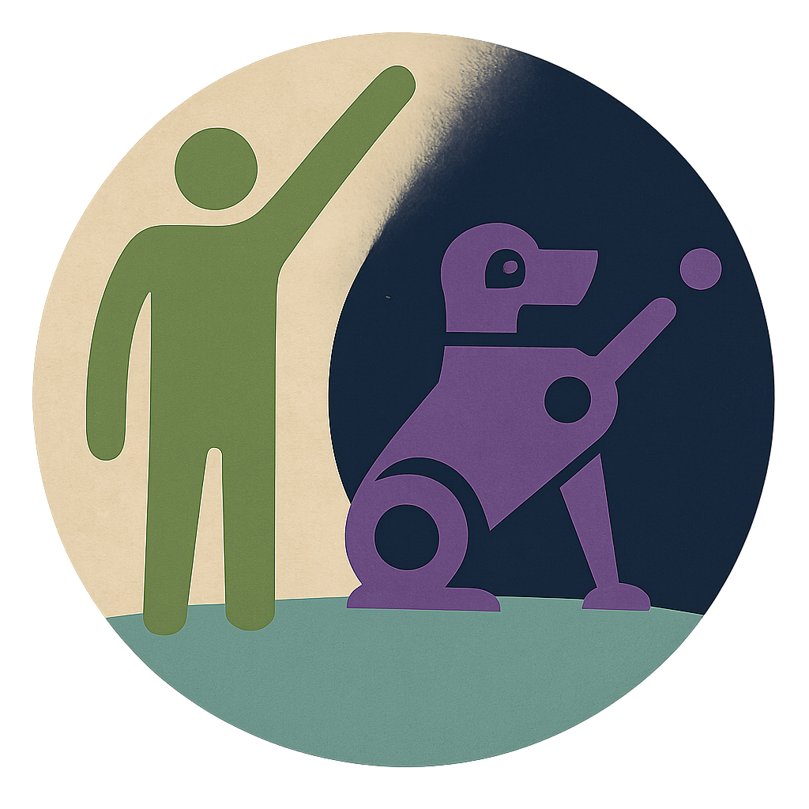
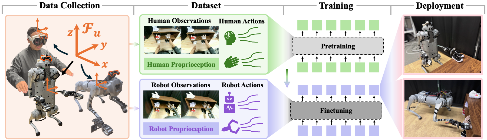
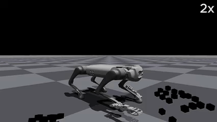

<h1 align="center">
  Human2LocoMan: Learning Versatile Quadrupedal Manipulation with Human Pretraining
</h1>
<p align="center">
  
</p>
<p align="center">
  <a href="https://chrisyrniu.github.io/" target="_blank">Yaru Niu</a><sup>1,*</sup>&nbsp;&nbsp;&nbsp;
  <a href="https://human2bots.github.io/" target="_blank">Yunzhe Zhang</a><sup>1,*</sup>&nbsp;&nbsp;&nbsp;
  <a href="https://human2bots.github.io/" target="_blank">Mingyang Yu</a><sup>1</sup>&nbsp;&nbsp;&nbsp;
  <a href="https://linchangyi1.github.io/" target="_blank">Changyi Lin</a><sup>1</sup>&nbsp;&nbsp;&nbsp;
  <a href="https://human2bots.github.io/" target="_blank">Chenhao Li</a><sup>1</sup>&nbsp;&nbsp;&nbsp;
  <a href="https://scholar.google.com/citations?user=7ZZ9fOIAAAAJ&hl=zh-CN" target="_blank">Yikai Wang</a><sup>1</sup>
  <br />
  <a href="https://yxyang.github.io/" target="_blank">Yuxiang Yang</a><sup>2</sup>&nbsp;&nbsp;&nbsp;
  <a href="https://wenhaoyu.weebly.com/" target="_blank">Wenhao Yu</a><sup>2</sup>&nbsp;&nbsp;&nbsp;
  <a href="https://research.google/people/tingnanzhang/?&type=google" target="_blank">Tingnan Zhang</a><sup>2</sup>&nbsp;&nbsp;&nbsp;
  <a href="https://scholar.google.com/citations?user=6LYI6uUAAAAJ&hl=en" target="_blank">Zhenzhen Li</a><sup>3</sup>&nbsp;&nbsp;&nbsp;
  <a href="https://jonfranc.com/" target="_blank">Jonathan Francis</a><sup>1,3</sup>&nbsp;&nbsp;&nbsp;
  <a href="https://scholar.google.com/citations?user=LYt_2MgAAAAJ&hl=en" target="_blank">Bingqing Chen</a><sup>3</sup>&nbsp;&nbsp;&nbsp;
  <br />
  <a href="https://www.jie-tan.net/" target="_blank">Jie Tan</a><sup>2</sup>&nbsp;&nbsp;&nbsp;
  <a href="https://www.meche.engineering.cmu.edu/directory/bios/zhao-ding.html" target="_blank">Ding Zhao</a><sup>1</sup>&nbsp;&nbsp;&nbsp;
  <br />
  <sup>1</sup>Carnegie Mellon University&nbsp;&nbsp;&nbsp;
  <sup>2</sup>Google DeepMind&nbsp;&nbsp;&nbsp;
  <sup>3</sup>Bosch Center for AI&nbsp;&nbsp;&nbsp;
  <br />
  <sup>*</sup>Equal contributions
</p>

<p align="center">
    Robotics: Science and Systems (RSS) 2025<br />
    <a href="https://human2bots.github.io/">Website</a> |
    <a href="https://www.arxiv.org/pdf/2506.16475">Paper</a> |
    <a href="https://huggingface.co/datasets/chrisyrniu/human2locoman">Dataset</a>
</p>
<p align="center">
  
</p>

## Overview
`Human2LocoMan` is a unified framework for collecting human demonstrations and teleoperated robot whole-body motions, along with cross-embodiment policy learning for versatile quadrupedal manipulation. This codebase provides the following key implementations of our work:
* A flexible human data collection pipeline with Apple Vision Pro
* An improved whole-body controller for the LocoMan robot, and VR-based teleoperation for robot data collection in simulation and the real world
* Training pipeline for our proposed Modularized Cross-Embodiment Transformer (MXT), including pretraining and finetuning.
* Baseline algorithms including [ACT](https://tonyzhaozh.github.io/aloha/), [HIT](https://humanoid-ai.github.io/), and [HPT](https://liruiw.github.io/hpt/)
* Policy rollout and evaluation pipeline

## Outline
- [Quick Start](#quick-start)
- [Code Structure](#code-structure)
- [Full Installation](#full-installation)
- [Hardware and Robot Setup](#hardware-and-robot-setup)
- [Human Data Collection](#human-data-collection)
- [Robot Data Collection](#robot-data-collection)
- [Unified Data Storage Format](#unified-data-storage-format)
- [Training and Evaluation](#training-and-evaluation)
- [Supported Embodiments](#supported-embodiments)
- [Acknowledgement](#acknowledgement)
- [Citation](#citation)

## Quick Start
### Finetune Pretrained MXT with Robot Data from Hugging Face
To get started quickly, you can use our pretrained [MXT checkpoints](https://huggingface.co/chrisyrniu/mxt) and [datasets](https://huggingface.co/datasets/chrisyrniu/human2locoman) from Hugging Face for your own training. The script below creates a virtual environment (for training only) from scratch, downloads the example model and dataset, and finetunes the human-pretrained model on our LocoMan data.  

```bash
cd ~ && git clone https://github.com/chrisyrniu/Human2LocoMan.git && \
conda create -n human2locoman python=3.8 && conda activate human2locoman && cd ~/Human2LocoMan && pip install -e . && \
python -c "from huggingface_hub import snapshot_download; repo_id = 'chrisyrniu/human2locoman'; local_dir = 'data'; files_to_download = ['toy_collect_unimanual/locoman/train/normal_objects/20241204_165456/*', 'toy_collect_unimanual/locoman/val/*']; snapshot_download(repo_id=repo_id, local_dir=local_dir, allow_patterns=files_to_download, repo_type='dataset')" && \
wget https://huggingface.co/chrisyrniu/mxt/resolve/main/toy_collect.ckpt && \
wget https://huggingface.co/chrisyrniu/mxt/resolve/main/toy_collect_config.json && \
mkdir models && mkdir pretrained_configs \
mv toy_collect.ckpt ./models/toy_collect.ckpt && mv toy_collect_config.json ./pretrained_configs/toy_collect_configs.json && \
python -u algos/train_mxt.py \
    --ckpt_dir ckpt/toy_collect_unimanual/finetuned \
    --dataset_dir data/toy_collect_unimanual/locoman \
    --embodiment_config_path algos/detr/models/mxt_definitions/configs/embodiments.yaml \
    --trunk_config_path algos/detr/models/mxt_definitions/configs/transformer_trunk.yaml \
    --policy_class MXT \
    --task_name toy_collect_unimanual_finetuned \
    --train_ratio 0.90 \
    --min_val_num 1 \
    --batch_size 16 \
    --lr 5e-5 \
    --lr_tokenizer 5e-5 \
    --lr_action_head 5e-5 \
    --lr_trunk 5e-5 \
    --seed 6 \
    --num_steps 60000 \
    --validate_every 1000 \
    --save_every 5000 \
    --chunk_size 60 \
    --no_encoder \
    --same_backbones \
    --feature_loss_weight 0.0 \
    --width 1280 \
    --height 480 \
    --use_wrist \
    --load_pretrain \
    --pretrained_path models/toy_collect.ckpt
```
As a note, you could check the configurations in the downloaded config file (e.g., `toy_collect_config.json`) and adjust the MXT network as needed. Specifically, modify `embodiments.yaml` and `transformer_trunk.yaml` located in `algos/detr/models/mxt_definitions/configs/`. All fields (except `dropout`) in `transformer_trunk.yaml` should be consistent with `/policy_config/transformer_args` in the pretraining `json` file. In `embodiments.yaml`, ensure that `output_dim` for `locoman/tokenizer` and `input_dim` for `locoman/action_head` match those of `human/tokenizer` and `human/action_head` in the `json` file, respectively.

## Code Structure

```
root
├── algos                     # algorithms including ACT, HIT, HPT, and MXT
│   ├── training_scripts      # training scripts for ACT, HIT, and MXT
│   │   └─ ...
│   ├── train_hit_or_act.py and train_mxt.py # main programs for training, called by the training scripts   
│   ├── policy.py             # policy wrappers for ACT, HIT, and MXT 
│   ├── utils.py              # data handling for ACT and HIT
│   ├── mxt_utils.py          # data handling for MXT
│   ├── detr                  # transformer-based network definitions
│   └── hpt_locoman           # link to the HPT implementation & training scripts
│
├── data_collection           # human and robot data collection pipeline
│   ├── collect_human_data    # human data collection
│   ├── avp_teleoperator_vuer # teleoperate the locoman robot and collect data with Apple Vision Pro
│   ├── tele_vision.py        # Open-Television code for video streaming
│   └── camera_utils.py       # camera hardware interface
│
├── locoman                   # locoman robot definitions, controllers, configs, etc.
│   ├── teleoperation         # other teleoperation methods for LocoMan, e.g. keyboard and joystick
│   └── ...                   # other components of the LocoMan system
│
└── rollout                   # policy rollout for evaluation
    └── rollout_script.sh     # example rollout script

```

## Full Installation 
We recommend using `Ubuntu 20.04`, while we also successfully test this codebase on `Ubuntu 22.04`.
1. Create a new virtual environment under Python 3.6, 3.7, 3.8 (3.8 recommended).
    ```bash
    conda create -n human2locoman python=3.8
    conda activate human2locoman
    ```
2. Install dependencies:
    ```bash
    pip install -e .
    conda install pinocchio -c conda-forge
    ```
    Note that the `numpy` version must be no later than `1.19.5` to avoid conflict with the Isaac Gym utility files.
    If you install a higher version of numpy, you can modify 'np.float' into 'np.float32' in the function 'get_axis_params' of the python file in 'isaacgym/python/isaacgym/torch_utils.py'

3. Install ROS:
   * Follow the steps [here](https://wiki.ros.org/noetic/Installation/Ubuntu) to install ROS Noetic.
   * If you are using a system newer than Ubuntu 20.04 (e.g., Ubuntu 22.04), we recommand installing [ROS Noetic from RoboStack with Pixi](https://robostack.github.io/GettingStarted.html) to launch the ROS master, and then installing the following ROS Noetic packages within your `Conda` environment:
        ```bash
        conda install -c robostack -c conda-forge ros-noetic-rospy ros-noetic-sensor-msgs ros-noetic-nav-msgs
        ```

4. Download and install IsaacGym Preview 4:
    * Download IsaacGym from [https://developer.nvidia.com/isaac-gym](https://developer.nvidia.com/isaac-gym). Extract the downloaded file to the root folder.
    * `cd isaacgym/python && pip install -e .`
    * Try running example `cd examples && python 1080_balls_of_solitude.py`. The code is set to run on CPU so don't worry if you see an error about GPU not being utilized.
    * IsaacGym [trouble shooting](https://docs.robotsfan.com/isaacgym/install.html#troubleshooting)

5. Build and install Go1 SDK.
   * First, Download the sdk in the folder of this repo
       ```bash
        git clone https://github.com/unitreerobotics/unitree_legged_sdk.git
       ```
   * Make sure the required packages are installed, following Unitree's [guide](https://github.com/unitreerobotics/unitree_legged_sdk). Most nostably, please make sure to install `Boost` and `LCM`:
       ```bash
       sudo apt install libboost-all-dev liblcm-dev libmsgpack-dev
       pip install empy catkin_pkg
       ```
   * Then, go to `unitree_legged_sdk` and create a build folder:
       ```bash
       cd unitree_legged_sdk
       mkdir build && cd build
       ```
   * Now, build the libraries and move them to the main directory by running:
       ```bash
       cmake -DPYTHON_BUILD=TRUE ..
       make
       ```
   * If you encounter the error `...can not be used when making a PIE object...`, add the following two lines below `project(unitree_legged_sdk)` (Line 2) in the `CMakeLists.txt` file:
       ```bash
        set(CMAKE_EXECUTABLE_FORMAT pie)
        add_link_options(-no-pie)
       ```

6. Install `ros_numpy` (tentative):
   ```bash
   git clone https://github.com/eric-wieser/ros_numpy.git
   cd ros_numpy
   pip install -e .
   ```

7. Install `jemalloc` to optimize memory allocation during training:
   * Follow the steps [here](https://support.sentieon.com/appnotes/jemalloc/).
   * Use Ubuntu 20.04 as an example:
   ```bash
   sudo apt update
   sudo apt install libjemalloc2
   echo 'export LD_PRELOAD=/usr/lib/x86_64-linux-gnu/libjemalloc.so.2' >> ~/.bashrc
   ```
8. Following the instructions in [OpenTeleVision](https://github.com/OpenTeleVision/TeleVision) to install [mkcert](https://github.com/FiloSottile/mkcert) and ca-certificats on Vision Pro.

## Hardware and Robot Setup

### Hardware
Pleasd refer to [hardware.md](doc/hardware.md) for the hardware guidance.

### Play the Robot in Simulation

#### Open two terminals:
The default configuration is playing the robot in the simulator with grippers.
```bash
cd locoman
python script/play_fsm.py --use_real_robot=False --use_gripper=True
```
```bash
python teleoperation/keyboard_teleoperator.py
```
### Real-Robot Setup
#### Switch GO1 to the Low-level Control Mode
* Press L2 + A twice to lower the robot
* Press L2 + B to release the joints
* Press L1 + L2 + Start to switch to the low-level conrol model

#### Robot Connection to the Server
* Manually set the IPv4 for the wired connection as `192.168.123.162` which should be different from the address of the onboard computer (e.g., `192.168.123.10`).

#### Gripper Usage
If using the gripper, first change the permission of the corresponding USB device (e.g., `ttyUSB0`)
```bash
sudo chmod 777 /dev/ttyUSB0
```
then start the gripper with the following commands
```bash
python manipulator/gripper_ros.py
```
#### Experiement with a real robot
Add "--use_real_robot=True" to use the real robot. We recommend using a Xbox joystick for intuitive commands. 
   ```bash
   python script/play_fsm.py --use_real_robot=True --use_gripper=True
   ```
   ```bash
   python teleoperation/keyboard_teleoperator.py
   ```   
   or
   ```bash
   python teleoperation/joystick_teleoperator.py
   ```
#### Mode selection (examples with `keyboard` or `joystick`, respectively)
* `0` or `A` - stance
* `1` or `+` - right-foot manipulation
* `2` or `-` - left-foot manipulation
* `3` or `B` - right-gripper manipulation
* `4` or `X` - left-gripper manipulation
* `5` or `Y` - locomotion
* `6` - loco-manipulation
* `7` - bimanual-manipulation

The initial mode of the robot is `stance`. Plesae check the [keyboard teleoperator](locoman/teleoperation/keyboard_teleoperator.py), [joystick teleoperator](locoman/teleoperation/joystick_teleoperator.py) and [FSM definitions](locoman/fsm/finite_state_machine.py) for more details about controller commands.

## Human Data Collection
<p align="center">
  
</p>
<p align="center">An example of two consecutive episodes of human data collection.</p>

### Implementation Steps
1. Connect the dual-lens camera mounted on the Apple Vision Pro to the server.
2. Run the following command to collect human data of the bimanual mode (`--manipulate_mode=3`) with a frequency of 60 (`--control_freq=60`), while saving the video from the main camera view (`--save_video=True`):
    ```bash
    python data_collection/collect_human_data.py --control_freq=60 --collect_data=True --manipulate_mode=3 --save_video=True --exp_name=test 
    ```
3. Open the Safari browser on the Apple Vision Pro, and go to the `Vuer` webpage: `https://your.shared.local.address:8012?ws=wss://your.shared.local.address:8012`, and then enter the VR session.
4. Pinch your left thumb and middle finger to reset/initialize the data recording, untill you see "PINCH to START" in red to show up.
5. Pinch your left thumb and index finger to start recording.
When you complete an episode, pinch your left thumb and middle finger to end the recording and reset the session.
Wait while "SAVING DATA" appears on the screen. The system will be ready for the next take once "PINCH TO START" is displayed again.

## Robot Data Collection
<p align="center">
  
  
</p>
<p align="center">We support teleoperation in both simulation and the real world.</p>

### Implementation Steps
1. To teleoperate the robot in simulation, directly run
    ```bash
    cd locoman
    python script/play_fsm.py --use_real_robot=False --use_gripper=True 
    ```

2. To teleoperate the robot in the real world:
- Connect the robot and the USB hub (which connects to the grippers and cameras) to the server.
- Set the robot to the low-level control mode and position it at a good pose.
- Start the gripper ros by running `python manipulator/gripper_ros.py`.
- Run `python script/play_fsm.py --use_real_robot=True --use_gripper=True` to reset the robot to the stance mode.
3. Run teleoperation for unimanual manipulation with the right end effector (`--teleop_mode=1`) with a control frequency of 60 (`--control_freq=60`), while saving the video from the main camera view (`--save_video=True`):
    ```bash
    python data_collection/avp_teleoperator_vuer.py --use_real_robot=True --teleop_mode=1 --use_wrist_cameara=True --control_freq=60 --collect_data=True --save_video=True --exp_name=test 
    ```
    For simulation teleop, set `--use_real_robot=False` and `--use_wrist_camera=False`.
4. Run `python teleoperation/keyboard_reset.py` to control the teleop data streaming, and then press `enter` on the keyboard to start streaming. The robot will switch to the corresponding manipulation mode (`--teleop_mode` from step 3).
5. Start the VR session on Vision Pro following step 3 in [Human Data Collection](#human-data-collection).
6. Pinch your left thumb and middle finger to initialize the robot to a reset pose.
7. Initialize the human pose to facilitate teleoperation: roughly keep the head level and facing forward, with both hands extended forward and palms facing down.
8. Pinch your left thumb and index finger to start teleoperating the robot and recording the data.
9. Pinch your left thumb and middle finger again to end this episode and reset the robot.

## Unified Data Storage Format
### Human and Robot Data
Each trajectory is stored in an hdf5 file with the following structure:
```
root
├── observations
│   ├── images
│   │   ├─ main          # images from main camera: [h * w * c] * traj_length
│   │   └─ wrist         # images from wrist cameras (at most two, right first): [h * w * c] * traj_length
│   └── proprioceptions       
│       ├─ body          # 6d pose of the rigid body where the main camera is mounted: [6] * traj_length
│       ├─ eef           # 6d pose of the end effectors (at most two, right first): [12] * traj_length
│       ├─ relative      # relative 6d pose of the end effector to the rigid body where the main camera is mounted (at most two, right first): [12] * traj_length
│       ├─ gripper       # gripper angle (at most two, right first): [2] * traj_length
│       └─ other         # other prorioceptive state, e.g., robot joint positions, robot joint velocities, human hand joint poses, ...
├── actions       
│   ├── body             # 6d pose of the rigid body where the main camera is mounted: [6] * traj_length
│   ├── delta_body       # delta 6d pose of the rigid body where the main camera is mounted: [6] * traj_length
│   ├── eef              # 6d pose of the end effectors (at most two, right first): [12] * traj_length
│   ├── delta_eef        # delta 6d pose of the end effectors (at most two, right first): [12] * traj_length
│   ├── gripper          # gripper angle (at most two, right first): [2] * traj_length
│   └── delta_gripper    # delta gripper angle (at most two, right first): [2] * traj_length
└── masks                # embodiment-specific masks to mask out observations and actions for training and inference (the mask for observations and actions of the same modality could be different)
    ├── img_main         # mask for the main camera image input: [1]
    ├── img_wrist        # mask for the wrist camera image input: [2]
    ├── proprio_body     # mask for the body 6d pose input: [6]
    ├── proprio_eef      # mask for the eef 6d pose input: [12]
    ├── proprio_gripper  # mask for the gripper angle input: [2]
    ├── proprio_other    # mask for other proprioception input (n components): [n]
    ├── act_body         # mask for the body 6d pose output: [6]
    ├── act_eef          # mask for the eef 6d pose output: [12]
    └── act_gripper      # mask for the gripper angle output: [2]
```

## Training and Evaluation

Example training scripts can be found at `algos/training_scripts/`. You need to specify the desired checkpoint folder and the dataset path. The dataset should be a directory containing (possibly nested) hdf5 files of recorded trajectories. 

### Dependencies for policy learning
First, please make sure you have installed the other dependencies in `requirements.txt` as in the 2nd step of [Installation](#installation). When you install IsaacGym, a very recent version of PyTorch could be installed as well. However, for training, We recommend using the following versions of dependencies to avoid compatibility issues:
```bash
conda install pytorch==1.13.0 torchvision==0.14.0 torchaudio==0.13.0 pytorch-cuda=11.7 -c pytorch -c nvidia && conda install mkl==2024.0.0
```
When you install IsaacGym via pip, this may create two versions of PyTorch in your environment. You can remove the one installed by pip with `pip uninstall torch`. Note that if you do not plan to teleoperate or collect data in the simulation, you can skip installing IsaacGym, ROS, Go1 SDK, etc.

### MXT Training
#### Modularized Network Configs
We use standalone config files at `algos/detr/models/mxt_definitions/configs` to control the configurations of the modularized tokenizers and detokenizers (`embodiments.yaml`) and the trunk (`transformer_trunk.yaml`). 

Feel free to modify the config files to accommodate your needs. We recommend you to explore and use different configs for different training stages and settings. For example, we find that a larger dropout rate (0.4 to 0.6) in the transformer body may improve training results.

#### Pretraining and Finetuning

First pretrain on human data: refer to `algos/training_scripts/mxt_script_template.sh` for an example script. You may use a larger learning rate like 1e-4 for this stage.

For all following exmaples, you can either use `train_ratio` (selecting the validation data files proportionately) or `min_val_num` (using a minimum number of validation data files) to control the size of the validation split.

```bash
python -u algos/train_mxt.py \
    --ckpt_dir your/desired/human/ckpt/dir \
    --dataset_dir your/human/dataset/dir \
    --embodiment_config_path algos/detr/models/mxt_definitions/configs/embodiments.yaml \
    --trunk_config_path algos/detr/models/mxt_definitions/configs/transformer_trunk.yaml \
    --policy_class MXT \
    --task_name task_name_for_saving_results \
    --train_ratio 0.99 \
    --min_val_num 1 \
    --batch_size 32 \
    --lr 1e-4 \
    --lr_tokenizer 1e-4 \
    --lr_action_head 1e-4 \
    --lr_trunk 1e-4 \
    --seed 6 \
    --num_steps 160000 \
    --validate_every 1000 \
    --save_every 8000 \
    --chunk_size 60 \
    --no_encoder \
    --same_backbones \
    --feature_loss_weight 0.0 \
    --width 1280 \
    --height 480 \
    --use_wrist \
    --wandb \
    --wandb_name name_for_wandb_experiment
```

Then finetune on the robot data: refer to `algos/training_scripts/mxt_finetune_script_template.sh` for an example script. The main difference is that you need to specify the `--load_pretrain` flag and provide a path to the pretrained checkpoint. You may use a smaller learning rate like 5e-5 for this stage.

```bash
python -u algos/train_mxt.py \
    --ckpt_dir your/desired/ckpt/dir \
    --dataset_dir your/locoman/dataset/dir \
    --embodiment_config_path algos/detr/models/mxt_definitions/configs/embodiments.yaml \
    --trunk_config_path algos/detr/models/mxt_definitions/configs/transformer_trunk.yaml \
    --policy_class MXT \
    --task_name task_name_for_saving_results \
    --train_ratio 0.95 \
    --min_val_num 1 \
    --batch_size 16 \
    --lr 5e-5 \
    --lr_tokenizer 5e-5 \
    --lr_action_head 5e-5 \
    --lr_trunk 5e-5 \
    --seed 6 \
    --num_steps 60000 \
    --validate_every 1000 \
    --save_every 5000 \
    --chunk_size 60 \
    --no_encoder \
    --same_backbones \
    --feature_loss_weight 0.0 \
    --width 1280 \
    --height 480 \
    --use_wrist \
    --load_pretrain \
    --pretrained_path your/desired/human/ckpt/dir/policy_last.ckpt \
    --wandb \
    --wandb_name name_for_wandb_experiment
```

#### Training from Scratch on Robot Data

You may still refer to `algos/training_scripts/mxt_script_template.sh` for training the model from scratch. You only need to provide the path to a robot dataset and adjust some hyperparameters.

```bash
python -u algos/train_mxt.py \
    --ckpt_dir your/desired/ckpt/dir \
    --dataset_dir your/locoman/dataset/dir \
    --embodiment_config_path algos/detr/models/mxt_definitions/configs/embodiments.yaml \
    --trunk_config_path algos/detr/models/mxt_definitions/configs/transformer_trunk.yaml \
    --policy_class MXT \
    --task_name task_name_for_saving_results \
    --train_ratio 0.95 \
    --min_val_num 1 \
    --batch_size 16 \
    --lr 5e-5 \
    --lr_tokenizer 5e-5 \
    --lr_action_head 5e-5 \
    --lr_trunk 5e-5 \
    --seed 6 \
    --num_steps 60000 \
    --validate_every 1000 \
    --save_every 5000 \
    --chunk_size 60 \
    --no_encoder \
    --same_backbones \
    --feature_loss_weight 0.0 \
    --width 1280 \
    --height 480 \
    --use_wrist \
    --wandb \
    --wandb_name name_for_wandb_experiment
```

### ACT or HIT Training

Refer to `algos/training_scripts/hit_act_script_template.sh` for an example. 

```bash
python -u algos/train_hit_or_act.py \
    --ckpt_dir your/desired/ckpt/dir \
    --dataset_dir your/dataset/dir \
    --policy_class <HIT or ACT> \
    --task_name task_name_for_saving_results \
    --train_ratio 0.95 \
    --min_val_num 1 \
    --batch_size 24 \
    --lr 2e-5 \
    --seed 6 \
    --hidden_dim 128 \
    --num_steps 100000 \
    --validate_every 1000 \
    --save_every 5000 \
    --chunk_size 120 \
    --same_backbones \
    --feature_loss_weight 0.001 \
    --backbone resnet18 \
    --width 640 \
    --height 480 \
    --wandb \
    --wandb_name name_for_wandb_experiment
```

### HPT Training
Download our adapted HPT implementation:

```bash
cd algos/hpt_locoman
git pull
```
Follow the [HPT instructions](https://github.com/alafumee/hpt_locoman) for training.

### Evaluation: Policy Rollout

`rollout/rollout_script.sh` provides an example script of running the rollout for evaluation. If you are attempting to evaluate an HPT model, you need to specify the `--hpt_domain` as the same dataset name used for training (or the last stage of finetuning). The script will look for `model.pth` in the provided checkpoint directory. For other methods, the loaded chekpoint should be `policy_last.ckpt` in the provided checkpoint directory.

A few important parameterss to note:

Operate mode (`--operate_mode`):
* 1 - right gripper only (default)
* 2 - left gripper only
* 3 - bimanual 

Policy type (`--policy_type`):
* 0 - MXT (default)
* 1 - ACT
* 2 - HIT
* others - HPT

Chunking size (`--action_chunk_size`): The length of the predicted action sequences. Should be the same as the chunking size specified during training.

Inference interval (`--inference_interval`): The number of steps between each prediction. This can be shorter than the chunking size.

## Supported Embodiments
- [x] Human
- [x] Unimanual LocoMan
- [x] Bimanual LocoMan
- [ ] G1 Humanoid
- [ ] X-Arm

## Acknowledgement
* We use [Open-TeleVision](https://robot-tv.github.io/) to stream captured human motions and first-person or first-robot video.
* Part of the training code is adapted from [HumanPlus](https://humanoid-ai.github.io/) and [HPT](https://liruiw.github.io/hpt/).

## Citation
If you find `Human2LocoMan` helpful to your research, please consider citing the paper:
```bibtex
@inproceedings{niu2025human2locoman,
  title={Human2LocoMan: Learning Versatile Quadrupedal Manipulation with Human Pretraining},
  author={Niu, Yaru and Zhang, Yunzhe and Yu, Mingyang and Lin, Changyi and Li, Chenhao and Wang, Yikai and Yang, Yuxiang and Yu, Wenhao and Zhang, Tingnan and Li, Zhenzhen and Francis, Jonathan and Chen, Bingqing and Tan, Jie and Zhao, Ding},
  booktitle={Robotics: Science and Systems (RSS)},
  year={2025}
}
```
<!-- ## Trouble Shooting -->
<!-- * Remove the local installed cuda dependencies to use the ones with PyTorch:
```
export LD_LIBRARY_PATH=$(echo $LD_LIBRARY_PATH | tr ':' '\n' | grep -v '/usr/local/cuda-12.2/lib64' | tr '\n' ':' | sed 's/:$//')
``` -->
