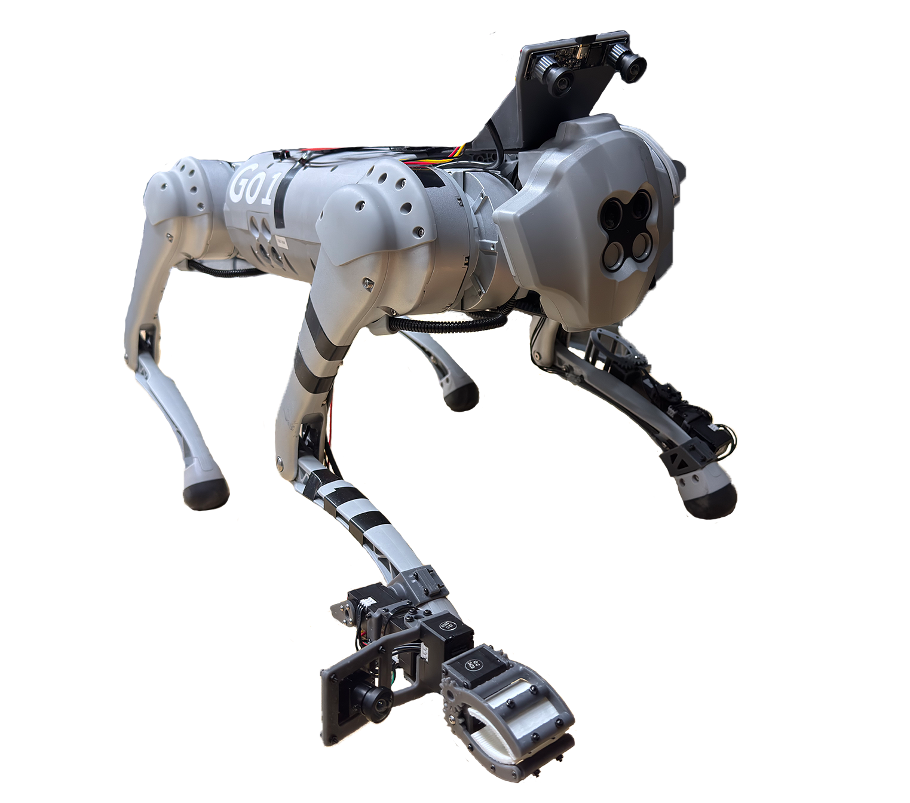
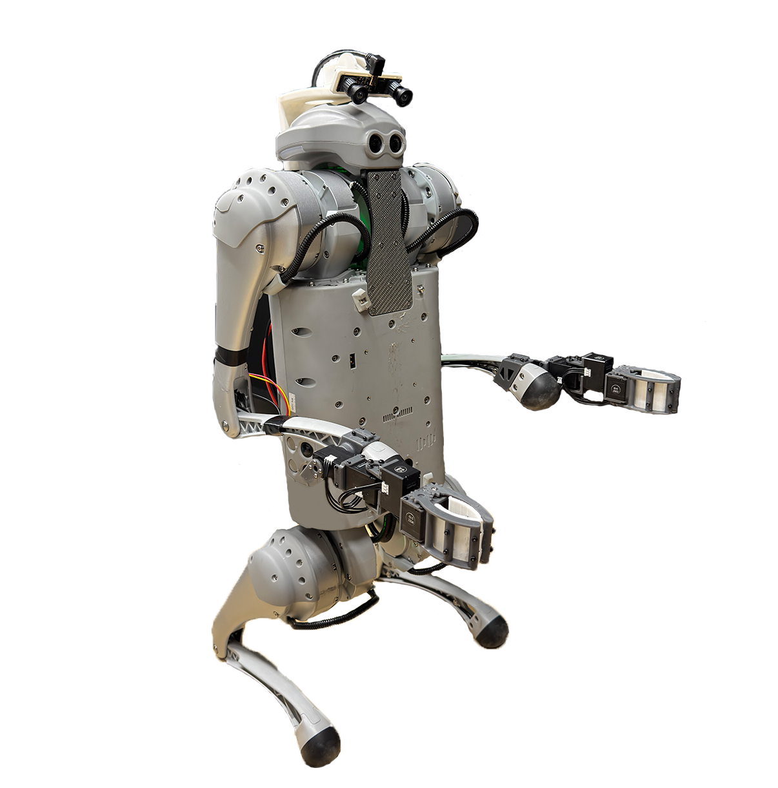
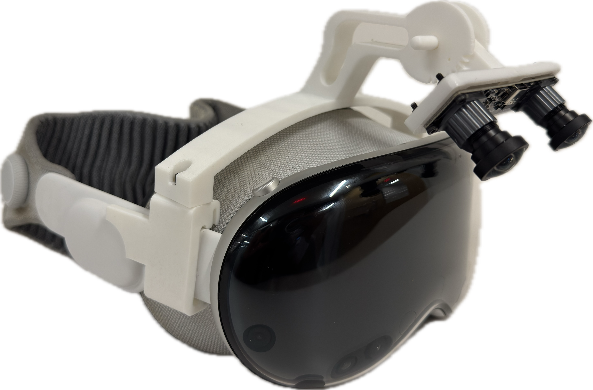

## Human2LocoMan Hardware
This is an extended documentation of [LocoMan hardware setup](https://github.com/linchangyi1/LocoMan/blob/main/LocoMan_Hardware/doc/hardware.md) to include revised or additional hardware for Human2LocoMan.

### Bill of Materials
| ID | Part                                      | Description                              | Price (per unit) | Quantity |
|----|-------------------------------------------|-----------------------------------|--------------|----------|
| 0 | [Unitree Go1 Robot](https://www.unitree.com/go1/) | Edu version |  | 1 |
|1-8| [DYNAMIXEL XC330-T288-T](https://www.robotis.us/dynamixel-xc330-t288-t/) | Servos for the manipulators | $98.89 | 8 |
| 9 | [DYNAMIXEL U2D2](https://www.robotis.us/u2d2/) | Convert control signals from PC to servos | $35.31 | 1 |
| 10 | [3P JST Expansion Board](https://www.robotis.us/3p-jst-expansion-board/) | Combine control signal and power to the manipulators | $6.49 | 1 |
| 11 | [100cm 3 Pin JST Cable (5pcs)](https://a.co/d/86x52YO) | Connect manipulators to the expansion board | $6.25 | 1 |
| 12 | [24V to 12V 10A Converter](https://a.co/d/bhacse1) | Convert 24V power from Go1 to 12V for the manipulators | $9.38 | 1 |
| 13 | [30cm XT30 Connector (2pcs)](https://a.co/d/2ftzIKc) | Connect Go1 power supply to the converter | $8.59 | 1 |
| 14 | [20ft Ethernet Cable](https://a.co/d/bZTsqN4) | Connect PC to Go1 | $18.99 | 1 |
| 15 | [USB Hub](https://www.amazon.com/dp/B00JX1ZS5O) | Connect PC to U2D2 and cameras | $13.46 | 1 |
| 16 | [Bearings 5x8x2.5mm (10pcs)](https://a.co/d/0Kc5usm) | Bearings for the rotational gripper | $8.19 | 1 |
| 17 | [Dual Lens USB Camera](https://www.amazon.com/dp/B0CBLZJZBT) | Main camera for all embodiments (human, unimanual LocoMan, bimanual LocoMan) | $96.99 | ≥2 |
| 18 | [USB Camera](https://www.amazon.com/dp/B0C3C2YVK9) (optional) | Wrist camera | $80.99 |  |
| 19 | [Printed parts of loco-manipulators](../hardware/loco_manipulators/print/) | 3D prints for loco-manipulators of LocoMan (including optional wrist camera mount) |  |1|
| 20 | [Printed parts of the human camera mount](../hardware/camera_mounts/human_apple_vision_pro/print/) | 3D prints for the camera mount on the Apple Vision Pro |  |1|
| 21 | [Printed parts of the camera mount for unimanual LocoMan](../hardware/camera_mounts/unimanual_locoman/print/) | 3D prints for the main camera mount on unimanual LocoMan |  |1|
| 22 | [Printed parts of the camera mount for unimanual LocoMan](../hardware/camera_mounts/bimanual_locoman/print/) | 3D prints for the main camera mount on bimanual LocoMan |  |1|

### Results

  
  
  

Left: Unimanual LocoMan w/ wrist cameras;  Middle: Bimanual LocoMan w/o wrist cameras; Right: Camera mounted AVP.

